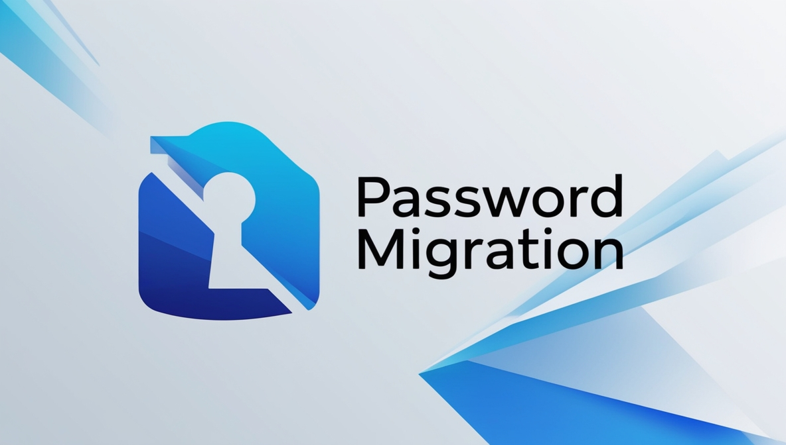

# Bitwarden to Keeper Conversion Script

This project is a modification of the original Bitwarden-to-Keeper script created by [Nam Namir](https://github.com/namnamir/Bitwarden-to-Keeper). The script has been modified by [Your Name] to add functionality for targeting specific folders and subcollections during migration.

## License

This project is licensed under the Apache License, Version 2.0. You may obtain a copy of the License at [Apache License 2.0](http://www.apache.org/licenses/LICENSE-2.0).

### Modifications

- Removed the normal Bitwarden JSON input and focused only on the organization JSON input.
- Added folder and subcollection-specific export functionality.
- Added helper functions and additional checks.

### Original License

The original version of this script is also licensed under the Apache License, Version 2.0, by Nam Namir.

If you would like to migrate from Vaultwarden, as a password manager, to Keeper, you can't use the built-in import feature of Keeper; it needs to be fixed. This tool helps you do it swiftly.

## How to use it?

## Vaultwarden to Keeper Migration Tool

If you would like to migrate from Vaultwarden, as a password manager, to Keeper, you can't use the built-in import feature of Keeper; it needs to be fixed. This tool helps you do it swiftly.

## How to Use It?

Export your passwords from Vaultwarden in JSON format. You need to export shared passwords (in collections related to the organization) separately. The output will be one `.json` file for personal items and another `.json` file for each organization if any organization is set up.

Modify the script and change the lines according to the exported items from Vaultwarden and specify the `.json` file name you would like to save the output. You can also define whether you want to log the password history; the default is `False`.

```python
# Exported Vaultwarden file paths
vaultwarden_file_normal = 'vaultwarden.json'
vaultwarden_file_organization = 'vaultwarden_org.json'

# Output path of the Keeper file
keeper_file = 'keeper.json'

# A flag to write the password change history into the note section
password_history_log = False
```

Also, if you'd like to make the Vaultwarden shared folders sharable on Keeper, please change the following False values to True.

```python
# Add shared folders (collections) to Keeper
if vaultwarden_item['collectionIds']:
    for id in vaultwarden_item['collectionIds']:
        keeper_item['folders'].append(
            {
                'shared_folder': vaultwarden_collections[id].replace('/', '\\'),
                'can_edit': False,  # For security reasons
                'can_share': False  # For security reasons
            }
        )
```

Run the script. The output will be a file called keeper.json if the default output file name (Step 2) is not changed.
Log in to your Keeper account and import this file.
